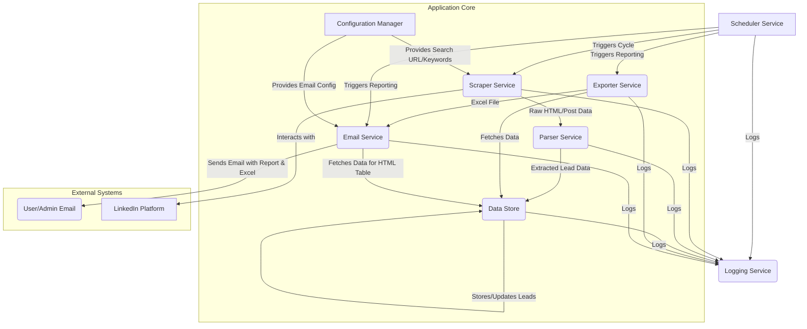

# High-Level Design (HLD) - LinkedIn Lead Generation Bot

## 1. Introduction

This document outlines the high-level design for a LinkedIn Lead Generation Bot. The application aims to automate the process of finding relevant leads from LinkedIn content searches, extracting key information, and delivering it via email.

## 2. Goals

*   Automate scraping of LinkedIn content based on user-defined search queries.
*   Extract specific information: posting user's name, post content, posted date, and LinkedIn profile URL.
*   Aggregate data into a structured format.
*   Deliver extracted leads via automated email with an HTML table and a downloadable Excel file.
*   Schedule scraping operations to run every 24 hours.
*   Implement mechanisms to handle LinkedIn's rate limiting and anti-bot measures.
*   Ensure data accuracy, deduplication, and robust error logging.

## 3. Major Components

The system will be composed of the following major components:

1.  **Scraper Service:**
    *   Responsibility: Interacts with LinkedIn using a headless browser (e.g., Playwright). Navigates to search result pages, scrolls to load content, and extracts raw HTML of relevant posts.
    *   Key Functions: Browser automation, search execution, dynamic content loading (scrolling), initial data extraction (HTML snippets).

2.  **Parser Service:**
    *   Responsibility: Takes raw HTML data from the Scraper Service and parses it to extract structured information (user name, post content, posted date, profile URL, post URL).
    *   Key Functions: HTML parsing (e.g., using BeautifulSoup), data cleaning, date normalization.

3.  **Data Store:**
    *   Responsibility: Persistently stores the extracted and processed lead information. Ensures data integrity and supports deduplication.
    *   Key Functions: Storing leads, retrieving leads for reporting, managing data schema.
    *   Initial Choice: SQLite (for CLI simplicity).
    *   Scalable Choice: PostgreSQL (for future enhancements, web UI).

4.  **Scheduler Service:**
    *   Responsibility: Triggers the scraping and reporting process at defined intervals (e.g., every 24 hours).
    *   Key Functions: Job scheduling, triggering main application workflow.
    *   Implementation: `APScheduler` (Python library) or OS-level cron jobs/Task Scheduler.

5.  **Exporter Service:**
    *   Responsibility: Generates an Excel (.xlsx) file from the lead data stored in the Data Store.
    *   Key Functions: Data retrieval from Data Store, Excel file generation (e.g., using `openpyxl` or Pandas).

6.  **Email Service:**
    *   Responsibility: Constructs and sends automated emails. The email will contain an HTML table view of the leads and the Excel file as an attachment.
    *   Key Functions: Email composition (HTML body, attachment), sending email via SMTP or email service API.
    *   Implementation: `smtplib` (Python) or third-party services (SendGrid, Mailgun).

7.  **Configuration Manager:**
    *   Responsibility: Manages application settings such as LinkedIn credentials (if used directly, with caution), search queries, email recipient(s), SMTP server details, database paths, and scraping parameters (delays, selectors).
    *   Key Functions: Loading and providing configuration values to other components.
    *   Implementation: JSON, YAML, or INI files; environment variables for sensitive data.

8.  **Logging Service:**
    *   Responsibility: Records application events, errors, warnings, and progress of scraping tasks for monitoring, debugging, and auditing purposes.
    *   Key Functions: Log message formatting, log level management, output to console/file.
    *   Implementation: Python's built-in `logging` module.

## 4. Communication Flow Diagram

**Workflow Description:**

1.  The `Scheduler Service` initiates the lead generation cycle.
2.  The `Scraper Service` retrieves search parameters (URL, keywords, filters) from the `Configuration Manager`.
3.  The `Scraper Service` accesses LinkedIn, performs the search, and gathers raw post data.
4.  Raw data is passed to the `Parser Service`, which extracts structured lead information.
5.  The `Data Store` saves the processed leads, handling deduplication based on post URL.
6.  At the appropriate time (or as part of the same cycle), the `Scheduler Service` triggers the reporting phase.
7.  The `Exporter Service` fetches the relevant leads (e.g., newly scraped, or all) from the `Data Store`.
8.  The `Exporter Service` generates an Excel file and provides it to the `Email Service`.
9.  The `Email Service` also fetches lead data (or uses data from the Exporter step) to build an HTML table.
10. The `Email Service` retrieves email configuration (recipient, SMTP settings) from the `Configuration Manager`.
11. The `Email Service` composes and sends the email with the HTML table and Excel attachment to the designated recipient.
12. All components utilize the `Logging Service` to record their operations and any issues.

## 5. Technology Choices & Justification

| Component Category         | Technology Choice                                  | Justification                                                                                                                                                              |
| :------------------------- | :------------------------------------------------- | :------------------------------------------------------------------------------------------------------------------------------------------------------------------------- |
| **Programming Language**   | Python                                             | Rich ecosystem for web scraping (Selenium, Playwright, BeautifulSoup), data manipulation (Pandas), Excel (openpyxl), email (smtplib). Rapid development, large community. |
| **Headless Browser**       | Playwright (or Selenium)                           | Modern web features support, robust automation, headless mode, cross-browser. Crucial for mimicking human interaction and handling JavaScript-heavy sites like LinkedIn. |
| **HTML Parsing**           | BeautifulSoup4                                     | Easy to use and powerful for parsing HTML/XML, simplifying data extraction from raw web content.                                                                          |
| **Data Store (Initial)**   | SQLite                                             | File-based, simple setup, suitable for a single-process CLI tool and initial development. No separate server needed.                                                     |
| **Data Store (Scalable)**  | PostgreSQL                                         | Robust, scalable, feature-rich for complex queries, concurrent access, and future web UI integration.                                                                    |
| **Scheduling**             | APScheduler (Python library) or OS-level tools     | `APScheduler`: In-process, flexible. OS-level (cron/Task Scheduler): Reliable for simple interval tasks.                                                                  |
| **Excel Export**           | `openpyxl` or Pandas `to_excel`                    | `openpyxl`: Fine-grained control. Pandas: Convenient for DataFrame export.                                                                                                 |
| **Email Service**          | `smtplib` (Python built-in) or API (SendGrid, Mailgun) | `smtplib`: Basic, no external dependency. API services: Better deliverability, analytics, handles email complexities.                                                    |
| **Configuration**          | JSON / YAML / INI files / Environment Variables    | Text files are easy for CLI tools. Env vars for sensitive data (API keys, passwords).                                                                                        |
| **Logging**                | Python `logging` module                            | Standard, flexible, configurable for various outputs and levels.                                                                                                           |

## 6. Non-Functional Requirements Addressing

*   **Scheduling (24 hours):** Addressed by the `Scheduler Service`.
*   **Rate Limiting & Anti-Bot Measures:**
    *   Use of headless browsers (Playwright) to render JavaScript and appear more like a real user.
    *   Implementation of random delays between actions.
    *   Rotation of User-Agents.
    *   Potential use of proxies (important for serious scraping).
    *   Graceful error handling and retry mechanisms for temporary blocks.
    *   Limiting the amount of data scraped in a single session.
*   **Data Accuracy & Deduplication:**
    *   Parser to carefully extract data using robust selectors (though these need maintenance).
    *   Data Store to enforce uniqueness on `post_url` to prevent duplicate entries.
*   **Error Logging:** Addressed by the centralized `Logging Service`.
*   **Admin UI (Optional):** Not in the initial CLI scope but can be built on top of the `Data Store` and core services if PostgreSQL is used and a web framework (e.g., Flask, Django) is introduced later. Manual triggers can be CLI arguments initially.

## 7. Scalability and Maintainability

*   **Scalability:** The initial design with SQLite is for a single user/instance. Migrating to PostgreSQL allows for better concurrency and larger datasets. The component-based architecture allows individual services to be scaled or optimized independently if needed in a more extensive system. For a CLI, scaling usually means running more instances with different queries if necessary, or improving the efficiency of one instance.
*   **Maintainability:**
    *   Modular design: Components have clear responsibilities.
    *   Configuration-driven: Search queries, selectors (critical!), and other parameters can be updated via config files without code changes.
    *   Logging: Essential for diagnosing issues.
    *   Fragility of Selectors: The CSS selectors for LinkedIn will be the most maintenance-heavy part, requiring regular updates as LinkedIn changes its UI.

## 8. Deployment Considerations (CLI Tool)

*   The application will be a Python script/set of scripts.
*   Dependencies managed via `requirements.txt`.
*   Execution can be manual or scheduled via OS utilities (cron, Task Scheduler) invoking the main script.
*   Configuration files will reside alongside the script or in a designated config directory.
*   Browser drivers for Playwright/Selenium will need to be installed or managed by the libraries. 