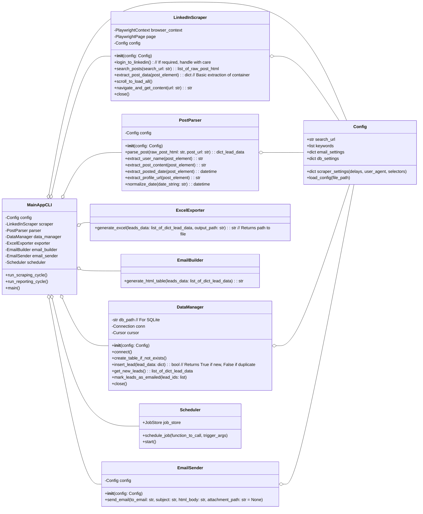

# Low-Level Design (LLD) - LinkedIn Lead Generation Bot

## 1. Introduction

This document provides a detailed low-level design for the LinkedIn Lead Generation Bot. It builds upon the High-Level Design (HLD) and specifies database schema, class structures, and pseudocode for key functionalities.

## 2. Database Schema (SQLite / PostgreSQL)

**Table: `leads`**

| Column Name        | Data Type                               | Constraints                      | Description                                                                      |
| :----------------- | :-------------------------------------- | :------------------------------- | :------------------------------------------------------------------------------- |
| `id`               | INTEGER (SQLite) / SERIAL (PostgreSQL)  | PRIMARY KEY, AUTOINCREMENT       | Unique identifier for the lead record.                                           |
| `profile_url`      | TEXT                                    |                                  | LinkedIn profile URL of the user who made the post.                              |
| `user_name`        | TEXT                                    |                                  | Name of the user who made the post.                                              |
| `post_content`     | TEXT                                    |                                  | The textual content/description of the LinkedIn post.                            |
| `posted_timestamp` | TIMESTAMP                               |                                  | Timestamp when the post was made. Standardized to UTC.                           |
| `post_url`         | TEXT                                    | UNIQUE, NOT NULL                 | Direct URL to the LinkedIn post. Used for deduplication.                           |
| `scraped_at`       | TIMESTAMP                               | DEFAULT CURRENT_TIMESTAMP        | Timestamp when this lead was scraped and inserted into the database.             |
| `is_emailed`       | BOOLEAN                                 | DEFAULT FALSE                    | Flag to indicate if this lead has been included in an email report.              |
| `search_query_ref` | TEXT                                    |                                  | Reference to the search query that found this lead (e.g., keywords, URL used). |

**Notes:**
*   `post_url` is critical for deduplication. The scraper should attempt to extract a permalink for each post.
*   `posted_timestamp` should be parsed and normalized (e.g., from "2h ago", "3d ago" to an actual timestamp).
*   `search_query_ref` helps in tracking the source of the lead if multiple queries are used.

## 3. Class Diagram (Conceptual for Python Implementation)



**Notes on Classes:**
*   `Config`: Holds all configuration, including CSS selectors for parsing, which is crucial as LinkedIn's structure changes.
*   `LinkedInScraper`: Manages Playwright browser interactions, navigation, scrolling, and fetching raw HTML of posts.
*   `PostParser`: Takes raw HTML from the scraper and extracts specific fields using CSS selectors defined in `Config`. This class is highly dependent on the stability of LinkedIn's HTML structure.
*   `DataManager`: Handles all database interactions (SQLite initially).
*   `ExcelExporter`: Creates the .xlsx file.
*   `EmailBuilder`: Creates the HTML table for the email body.
*   `EmailSender`: Sends the email using `smtplib` or an email service API.
*   `Scheduler`: Manages the cron-like job scheduling (e.g., using `APScheduler`).
*   `MainAppCLI`: The main orchestrator for the CLI application.

## 4. Pseudocode / Logic Flow

### 4.1. Main Application Logic (CLI - `main_script.py`)

```pseudocode
FUNCTION main():
    LOAD configuration from config file (e.g., config.json) INTO config_object

    INITIALIZE DataManager with config_object
    CALL data_manager.create_table_if_not_exists()

    INITIALIZE Scheduler
    CALL scheduler.schedule_job(run_full_cycle, trigger='interval', hours=24, args=[config_object])
    // Optionally, add a way to trigger manually via CLI argument
    // e.g., IF --run-now in sys.argv THEN run_full_cycle(config_object)

    PRINT "Scheduler started. First run will be now or as per schedule."
    CALL scheduler.start() // This might block, or run in a thread

FUNCTION run_full_cycle(config):
    PRINT "Starting new lead generation cycle."
    CALL logger.info("Starting new lead generation cycle.")

    INITIALIZE LinkedInScraper with config
    INITIALIZE PostParser with config
    INITIALIZE DataManager with config // Or use existing instance if passed

    TRY:
        // --- Scraping Phase ---
        posts_container_html = scraper.navigate_and_get_content(config.search_url)
        // This would involve: 
        // 1. scraper.go_to_url(config.search_url)
        // 2. scraper.handle_login_if_needed() // Complex, might need manual setup first
        // 3. scraper.scroll_to_load_all_posts_on_page() 
        // 4. raw_post_elements = scraper.extract_all_post_elements_from_page() 
        
        new_leads_found_count = 0
        FOR each raw_post_element IN raw_post_elements:
            // It's often better to get post_url first, check DB, then parse fully
            potential_post_url = parser.extract_post_url(raw_post_element)
            IF data_manager.is_post_url_new(potential_post_url):
                lead_data = parser.parse_post(raw_post_element, potential_post_url) 
                // lead_data includes: name, content, date, profile_url, post_url
                IF lead_data IS NOT NULL AND lead_data.post_url IS NOT NULL:
                    success = data_manager.insert_lead(lead_data)
                    IF success: new_leads_found_count += 1
                ELSE:
                    logger.warning("Could not parse post or missing post_url for element.")
            ELSE:
                logger.info(F"Post {potential_post_url} already exists. Skipping.")
        
        PRINT F"{new_leads_found_count} new leads scraped and stored."
        logger.info(F"{new_leads_found_count} new leads scraped and stored.")

        // --- Reporting Phase ---
        IF new_leads_found_count > 0 OR config.always_send_report:
            new_leads_for_email = data_manager.get_new_leads_since_last_email() // or get_all_new_leads()
            IF new_leads_for_email IS NOT EMPTY:
                INITIALIZE ExcelExporter
                excel_file_path = exporter.generate_excel(new_leads_for_email, "linkedin_leads.xlsx")

                INITIALIZE EmailBuilder
                html_table = email_builder.generate_html_table(new_leads_for_email)

                INITIALIZE EmailSender with config
                email_subject = F"LinkedIn Leads Report - {current_date}"
                sender.send_email(to_email=config.recipient_email, 
                                 subject=email_subject, 
                                 html_body=html_table, 
                                 attachment_path=excel_file_path)
                
                PRINT "Email report sent."
                logger.info("Email report sent.")
                // data_manager.mark_leads_as_emailed(new_leads_for_email) // Update status
            ELSE:
                PRINT "No new leads to report."
                logger.info("No new leads to report.")
        ELSE:
            PRINT "No new leads found in this cycle, skipping email report."
            logger.info("No new leads found, skipping email report.")

    CATCH AnyException as e:
        PRINT F"Error during cycle: {e}"
        logger.error(F"Error during lead generation cycle: {e}", exc_info=True)
    FINALLY:
        IF scraper IS NOT NULL: scraper.close()
        IF data_manager IS NOT NULL: data_manager.close() // If applicable
    PRINT "Lead generation cycle finished."
    logger.info("Lead generation cycle finished.")
```

### 4.2. Scraper Logic (`LinkedInScraper` class)

**Key Challenge:** Identifying reliable CSS selectors for LinkedIn elements. These selectors will need to be stored in `config.json` and updated frequently as LinkedIn changes its website structure.

```pseudocode
CLASS LinkedInScraper:
    METHOD __init__(config):
        this.config = config
        this.playwright = SYNC_PLAYWRIGHT.start()
        this.browser = this.playwright.chromium.launch(headless=config.scraper_settings.headless)
        // Apply user agent from config if specified
        this.context = this.browser.new_context(user_agent=config.scraper_settings.user_agent)
        this.page = this.context.new_page()

    METHOD navigate_and_search(search_url):
        this.page.goto(search_url, wait_until='networkidle', timeout=60000)
        // Handle potential login pop-ups or redirects if necessary (complex part)
        // e.g., if page.query_selector(config.selectors.login_popup): handle_login()
        this.page.wait_for_timeout(config.scraper_settings.initial_load_delay_ms) // Wait for initial content

    METHOD scroll_to_load_all(scroll_pause_time_ms, max_scrolls):
        last_height = this.page.evaluate("document.body.scrollHeight")
        scroll_count = 0
        WHILE scroll_count < max_scrolls:
            this.page.evaluate("window.scrollTo(0, document.body.scrollHeight);")
            this.page.wait_for_timeout(scroll_pause_time_ms)
            new_height = this.page.evaluate("document.body.scrollHeight")
            IF new_height == last_height:
                BREAK // Reached bottom or no new content
            last_height = new_height
            scroll_count += 1
            PRINT F"Scrolled {scroll_count} times."

    METHOD extract_post_elements():
        // THIS IS THE MOST CRITICAL AND FRAGILE PART
        // Selectors must be identified by inspecting LinkedIn's HTML and will change.
        // Example: config.selectors.post_container = 'div.feed-shared-update-v2'
        post_elements = this.page.query_selector_all(config.selectors.post_container)
        return post_elements

    METHOD close():
        this.browser.close()
        this.playwright.stop()

// Example of how selectors might be structured in config.json:
// "selectors": {
//   "post_container": "css-selector-for-each-post-block",
//   "user_name": "css-selector-for-user-name-within-post-block",
//   "profile_url": "css-selector-for-profile-link-within-post-block", (attribute: 'href')
//   "post_content": "css-selector-for-post-text-area",
//   "posted_date": "css-selector-for-date-string",
//   "post_permalink": "css-selector-for-permalink-of-post" (attribute: 'href')
// }
```

### 4.3. Parser Logic (`PostParser` class)

```pseudocode
CLASS PostParser:
    METHOD __init__(config):
        this.config = config.selectors // Specific selectors for parsing

    METHOD parse_post(post_element_html_or_playwright_element, base_url="https.www.linkedin.com"):
        // Use BeautifulSoup to parse the HTML snippet of a single post
        // For each field, use the corresponding CSS selector from this.config
        // If using Playwright elements directly, use element.query_selector()

        TRY:
            user_name = post_element.query_selector(this.config.user_name).inner_text().strip()
            post_content_element = post_element.query_selector(this.config.post_content)
            post_content = post_content_element.inner_text().strip() // May need cleaning, handle "See more"
            
            // Date parsing is tricky, needs normalization
            date_string = post_element.query_selector(this.config.posted_date).inner_text().strip()
            posted_timestamp = this.normalize_date(date_string)

            // Profile URL might be part of the user_name link or separate
            profile_url_element = post_element.query_selector(this.config.profile_url) // e.g., an <a> tag
            profile_url = profile_url_element.get_attribute('href')
            IF NOT profile_url.startswith("http"):
                profile_url = base_url + profile_url // Ensure it's absolute

            // Post URL (permalink) is crucial for deduplication
            post_url_element = post_element.query_selector(this.config.post_permalink)
            post_url = post_url_element.get_attribute('href')
            IF NOT post_url.startswith("http"):
                post_url = base_url + post_url // Ensure it's absolute

            RETURN {
                "user_name": user_name,
                "post_content": post_content,
                "posted_timestamp": posted_timestamp,
                "profile_url": profile_url,
                "post_url": post_url
            }
        CATCH Exception as e:
            logger.error(F"Error parsing post element: {e}")
            RETURN NULL

    METHOD normalize_date(date_string): // Example
        IF "h ago" in date_string or "hr ago" in date_string:
            hours = int(date_string.split("h")[0])
            return datetime.now(timezone.utc) - timedelta(hours=hours)
        ELSE IF "d ago" in date_string:
            days = int(date_string.split("d")[0])
            return datetime.now(timezone.utc) - timedelta(days=days)
        ELSE IF "w ago" in date_string:
            weeks = int(date_string.split("w")[0])
            return datetime.now(timezone.utc) - timedelta(weeks=weeks)
        ELSE IF "Just now" in date_string:
            return datetime.now(timezone.utc)
        // Add more cases: specific dates (e.g., "Mar 15"), etc.
        // This needs to be robust.
        TRY:
            // Attempt parsing known formats if LinkedIn provides them
            return datetime.strptime(date_string, '%b %d, %Y').replace(tzinfo=timezone.utc) // Example
        CATCH ValueError:
            logger.warning(F"Could not parse date string: {date_string}")
            return datetime.now(timezone.utc) // Fallback or leave NULL
```

### 4.4. Email Builder Logic (`EmailBuilder` class)

```pseudocode
CLASS EmailBuilder:
    METHOD generate_html_table(leads_data):
        html = "<html><body><h2>LinkedIn Leads Report</h2>"
        html += "<table border='1'><tr><th>User Name</th><th>Post Content</th><th>Posted Date</th><th>Profile URL</th><th>Post URL</th></tr>"
        FOR lead IN leads_data:
            html += "<tr>"
            html += F"<td>{escape(lead.user_name)}</td>"
            html += F"<td>{escape(lead.post_content)}</td>"
            html += F"<td>{lead.posted_timestamp.strftime('%Y-%m-%d %H:%M')}</td>"
            html += F"<td><a href='{escape(lead.profile_url)}'>{escape(lead.profile_url)}</a></td>"
            html += F"<td><a href='{escape(lead.post_url)}'>{escape(lead.post_url)}</a></td>"
            html += "</tr>"
        html += "</table></body></html>"
        RETURN html
```

## 5. Configuration File (`config.json` - Example)

```json
{
  "search_url": "https://www.linkedin.com/search/results/content/?datePosted=%22past-24h%22&keywords=%22freelance%22%20AND%20(%22Backend%20Developer%22%20OR%20%22Web%20Developer%22%20OR%20%22Full%20Stack%20Developer%22)%20NOT%20%22onsite%22%20.India&origin=FACETED_SEARCH&sid=vYc",
  "output_excel_file": "linkedin_leads.xlsx",
  "database": {
    "type": "sqlite",
    "path": "leads.db"
  },
  "email_settings": {
    "send_email": true,
    "smtp_server": "smtp.example.com",
    "smtp_port": 587,
    "smtp_user": "your_email@example.com",
    "smtp_password": "your_email_password", // Consider using env variables or secrets manager
    "sender_email": "bot@example.com",
    "recipient_email": "your_actual_email@example.com",
    "subject_prefix": "LinkedIn Leads Report"
  },
  "scraper_settings": {
    "headless": true,
    "user_agent": "Mozilla/5.0 (Windows NT 10.0; Win64; x64) AppleWebKit/537.36 (KHTML, like Gecko) Chrome/98.0.4758.102 Safari/537.36", // Example, can rotate
    "initial_load_delay_ms": 5000,
    "scroll_pause_time_ms": 3000,
    "max_scrolls": 10, // Adjust based on typical page length
    "anti_bot_delay_min_ms": 1000, // Min delay between certain actions
    "anti_bot_delay_max_ms": 3000  // Max delay
  },
  "selectors": {
    "post_container": "div.feed-shared-update-v2", // EXAMPLE - MUST BE VERIFIED/UPDATED
    "user_name": ".feed-shared-actor__name span[aria-hidden='true']", // EXAMPLE
    "profile_url": ".feed-shared-actor__container-link", // EXAMPLE (attribute: href)
    "post_content": ".feed-shared-update-v2__description .feed-shared-text", // EXAMPLE
    "posted_date": ".feed-shared-actor__sub-description .visually-hidden", // EXAMPLE
    "post_permalink": ".feed-shared-update-v2__control-menu .feed-shared-control-menu__trigger", // This usually opens a menu, then need to click "copy link to post". Simpler might be to get a link from timestamp or other element if available.
    "see_more_button": ".feed-shared-inline-show-more-text__see-more-less-toggle"
  },
  "logging": {
    "level": "INFO", // DEBUG, INFO, WARNING, ERROR, CRITICAL
    "file": "app.log"
  }
}
```

**Important Note on Selectors:** The CSS selectors provided in the example `config.json` are illustrative and **will almost certainly be incorrect or outdated.** Finding the correct and robust selectors for LinkedIn requires careful inspection of the live website's HTML structure using browser developer tools and is an ongoing maintenance task.

## 6. Error Handling and Anti-Bot Measures (Details)

*   **Random Delays:** Implement `random.uniform(min_delay, max_delay)` between page navigations, scrolls, and possibly clicks.
*   **User-Agent Rotation:** Have a list of valid User-Agents in config and pick one randomly for each session.
*   **Headless Mode Detection:** Some sites try to detect headless browsers. Playwright/Selenium have options to mitigate this (e.g., modifying JavaScript properties).
*   **CAPTCHAs:** If CAPTCHAs are encountered, the script will likely fail. Solving CAPTCHAs programmatically is complex and often requires third-party services (e.g., 2Captcha), which adds cost and complexity.
*   **Login:** Scraping LinkedIn content search results without login might be possible for some public content, but often a login is needed for deeper access or personalized results. Managing login sessions securely (avoiding hardcoding credentials) and handling 2FA is a major challenge. Using existing browser session cookies can be an option but is harder to automate reliably across runs.
*   **Rate Limiting:** If LinkedIn detects bot-like activity, it might temporarily block the IP or account. Implement exponential backoff for retries on HTTP errors like 429 (Too Many Requests) or 503 (Service Unavailable).
*   **Data Validation:** Validate extracted data (e.g., URLs look like URLs, dates are plausible) before inserting into the database.
*   **Logging:** Detailed logging of actions, fetched URLs, and errors is crucial for debugging.

This LLD provides a foundation. The implementation will require significant effort in handling the dynamic nature of LinkedIn and its anti-scraping measures. 